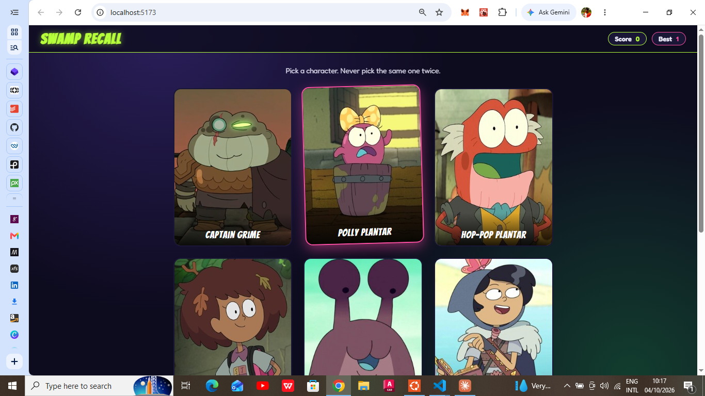
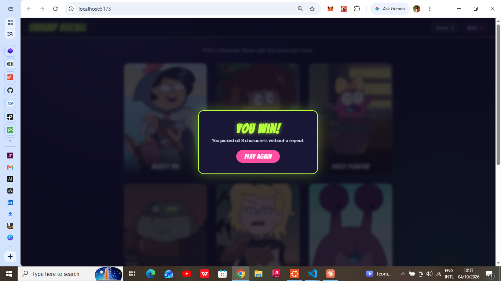

# Swamp Recall

A memory card game themed around the animated series *Amphibia*. Click each character once, and never the same one twice. Built with React.

**[Live demo](https://memory-card-seven.vercel.app/)**

 
 

## How to play

- Eight character cards are shown in a random order.
- Click a card you haven't picked yet: your score goes up by 1 and the cards reshuffle.
- Click a card you've already picked: the round ends, your score resets to 0, and the grid shakes.
- Pick all 8 without a repeat to win.
- Your best score is tracked across rounds.

## Features

- Character names and images fetched from the TVmaze API
- Cards reshuffle on mount and after every click (Fisher-Yates shuffle)
- Current score and best score
- Win modal with a Play Again button
- Loss feedback: grid shake and a red score flash
- Loading and error states
- Responsive layout, with `prefers-reduced-motion` respected

## Built with

- [React](https://react.dev/) (hooks: `useState`, `useEffect`, plus a custom `useCharacters` hook)
- [Vite](https://vitejs.dev/)
- Plain CSS (Grid, Flexbox, custom properties, keyframe animations)
- [TVmaze API](https://www.tvmaze.com/api) for character data

## Getting started

```bash
git clone https://github.com/Dee-pack/memory-card.git
cd memory-card
npm install
npm run dev
```

The app runs at `http://localhost:5173`.

To create a production build:

```bash
npm run build
npm run preview
```

## Project structure

```
src/
  components/
    Card.jsx
    CardGrid.jsx
    Scoreboard.jsx
    WinModal.jsx
  hooks/
    useCharacters.js   # fetches and shapes API data
  utils/
    shuffle.js         # Fisher-Yates shuffle
  App.css 
  App.jsx              # game state and logic
  main.jsx
```

## What I learned

- Managing state in one place and passing data down through props
- Deriving values (score, win condition) instead of duplicating state
- Fetching data in `useEffect` with cleanup to avoid stale updates
- Using stable `key` props when list order changes
- Conditional rendering and class toggling for animations

## Credits

- Character data and images via the [TVmaze API](https://www.tvmaze.com/api)
- Fonts: Bangers and Fredoka from Google Fonts
- *Amphibia* and its characters belong to Disney and creator Matt Braly. This is a non-commercial fan project and isn't affiliated with or endorsed by them.

## Author

**[Dee Pack]** · [GitHub](https://github.com/Dee-pack) · [LinkedIn](https://www.linkedin.com/in/daniel-pinmiloye-631b8b375/)